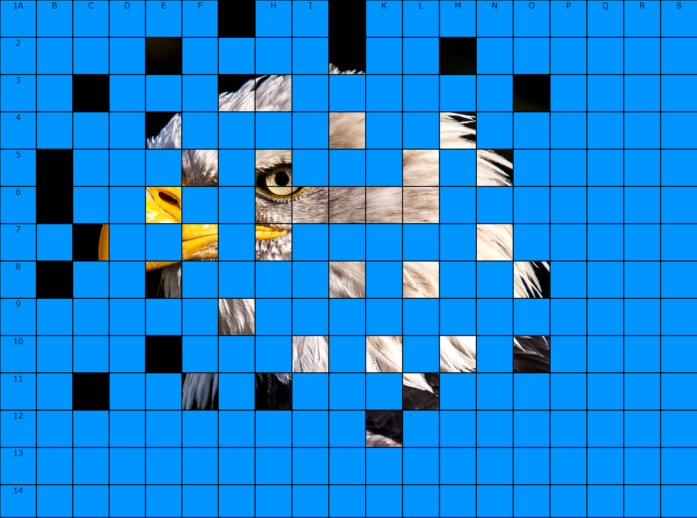

# Odkrývačka

### Pravidla:
Pomocí myši odkrýváš jednotlivá políčka, ale nemůžeš vybrat žádné z osmi sousedních políček posledního vybraného políčka.

### Spuštění:
Stačí v prohlížeči otevřít soubor `index.html`.

### Příprava hry:
Do složky `obrazky` nahraj očíslované obrázky ve formátu **obrazekXX.jpg**, kde XX označuje postupně se zvyšující číslice (1,2,3,...).
Po spuštění aplikace zadej velikost políček. Velikost se zadává v pixelech a políčka jsou čtvercová.

Obrázek se zvětšuje v poměru rozměrů na celou obrazovku, doporučuji tedy použít **celoobrázkový režim** (klávesa `F11`).

